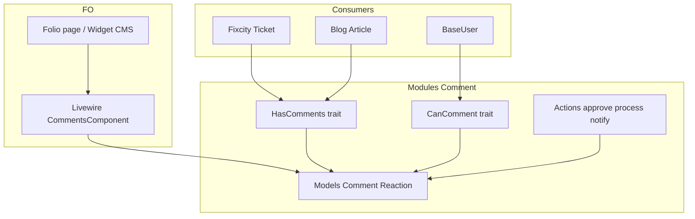

# Architettura — Native Comments Engine

## Visione

Motore commenti **polimorfico**, **moderabile**, **notificabile** — owner unico modulo `Comment`, integrabile su qualsiasi modello (`Ticket`, `Article`, …) via trait `HasComments`.



## Layer

| Layer | Responsabilità | Vietato |
|-------|----------------|---------|
| **Modello commentabile** | `use HasComments` + `commentableName()` + `commentUrl()` | Query commenti nel tema |
| **Commentatore** | `CanComment` + `InteractsWithComments` su `BaseUser` | `RoutesNotifications` duplicato |
| **Modulo Comment** | Persistenza, moderazione, notifiche, UI Livewire | Business logic Fixcity |
| **Tema / Fixcity** | `<livewire:…>` o ViewEntry Filament | Fork logica Spatie in `packages/` |

## Miglioramenti vs Spatie fork

1. **Connessione DB** — modelli su connection `comment` (già iniziato)
2. **XotBaseModel** — `created_by`, `updateTimestamps`, soft deletes coerenti
3. **Actions** — `ApproveCommentAction`, `ProcessCommentAction` con `QueueableAction`
4. **No Http\Controllers** — signed unsubscribe/approve → Action invocate da route sottili in `RouteServiceProvider`
5. **Config unica** — `CommentConfig::make()` invece di due classi `Support\Config`
6. **FO Filament-ready** — widget opzionale `Comment\TicketCommentsWidget` per ticket detail (STORY-157)
7. **i18n** — `Modules/Comment/lang/{locale}/` (no label hardcoded)

## Contratto `HasComments`

```php
// Su Ticket, Article, …
use Modules\Comment\Models\Concerns\HasComments;

public function commentableName(): string { return $this->name; }
public function commentUrl(): string { return LaravelLocalization::localizeURL('/tickets/'.$this->getKey()); }
```

## Contratto `CanComment`

Path: `app/Models/Contracts/CanComment.php` — capacità **solo Eloquent** (come `Rating\Models\Contracts\HasRatingContract`), non `app/Contracts/` cross-modulo.

Già su `BaseUser` via `InteractsWithComments` (ex Spatie, senza conflitto Notifiable).

## Schema DB (owner Comment)

Tabelle: `comments`, `reactions`, `comment_notification_subscriptions`, `comment_notification_opt_outs` — migrazione `2024_01_01_000010_create_comments_table.php`.

## Provider target

Caricamento via **manifest** (`module.json` + `composer.json`) — **non** `$this->app->register()` nel padre.

```
module.json / composer.json extra.laravel.providers
├── CommentServiceProvider (XotBase — boot standard modulo)
├── CommentEngineServiceProvider
│     ├── Livewire components
│     ├── Policies
│     ├── Routes asset comment::assets.*
│     └── (fasi) signed approval / unsubscribe
└── Filament\AdminPanelProvider
```

→ [module-providers-manifest.md](../concepts/module-providers-manifest.md)

## Consumer attuali

| Consumer | Uso |
|----------|-----|
| `Fixcity\Ticket` | `HasComments` |
| `Blog\Article` | `HasComments` (TwentyOne) |
| `BaseUser` | `CanComment` |
| `ticket-comments.blade.php` | `<livewire:comments>` |

## Anti-pattern

- ❌ Mantenere `packages/spatie` come SSoT
- ❌ `Spatie\Comments\Models\Comment` come base eterna
- ❌ Controller nuovi in `app/Http/Controllers`
- ❌ Service class per moderazione
