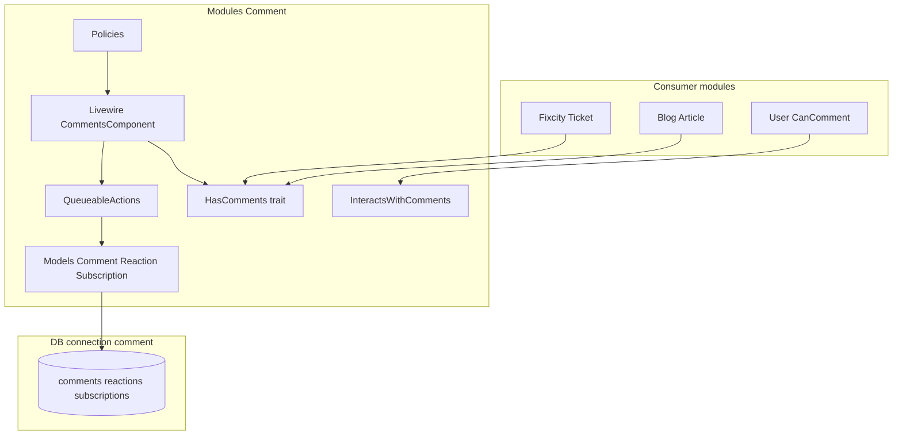

# Architettura commenti nativi (Modules\Comment)

## Scopo (perché)

Oggi il modulo **Comment** è un guscio Laraxot attorno a fork path-composer `packages/spatie/*` (`spatiex/laravel-comments`). Funziona ma:

- Namespace esterno (`Spatie\Comments`) in consumer (Fixcity, Blog, User)
- Doppia manutenzione fork + upstream
- Asset UI Spatie disallineati dal design system Sixteen/Fixcity
- Violazione potenziale regole progetto (Services, Controller legacy)

**Visione:** modulo Comment **owner** del dominio commenti — morph polimorfico, thread, reazioni, notifiche, moderazione — integrabile su qualsiasi `commentable` (Ticket, Article, …) con `<livewire:comments :model="$record" />`.

**Zen:** il commento è conversazione sul territorio/cittadinanza, non widget generico incollato.

---

## Stato attuale vs target

| Aspetto | Oggi | Target |
|---------|------|--------|
| Core | `Spatie\Comments\*` in `packages/spatie/laravel-comments` | `Modules\Comment\*` |
| Livewire | `Spatie\LivewireComments\*` | `Modules\Comment\Http\Livewire\*` |
| Model Comment | extends `Spatie\Comments\Models\Comment` | `Comment extends BaseModel` (logica portata) |
| DB | migration module + schema Spatie | **invariato** (data sacred) |
| Config | `laravel/config/comments.php` → classi Spatie | `Modules/Comment/config/comments.php` |
| Composer | path repo `packages/spatie` | solo `laraxot/module_comment_fila5` |
| Trait FO | `HasComments` Spatie | `Modules\Comment\Models\Concerns\HasComments` |
| Commentator | `InteractsWithSpatieComments` | `InteractsWithComments` |

---

## Layer architetturali



---

## Contratto commentable

Ogni modello commentabile:

```php
use Modules\Comment\Models\Concerns\HasComments;

class Ticket extends BaseModel
{
    use HasComments;

    public function commentableName(): string { /* per notifiche */ }
    public function commentUrl(): string { /* deep link FO */ }
}
```

Utente che commenta:

```php
use Modules\Comment\Models\Concerns\InteractsWithComments;
use Modules\Comment\Models\Contracts\CanComment;

class BaseUser implements CanComment
{
    use InteractsWithComments; // no RoutesNotifications duplicato
}
```

---

## Flusso creazione commento

1. FO/Admin: `CommentsComponent::comment()` valida testo
2. `$model->comment($text)` via trait `HasComments`
3. `ProcessCommentAction` (QueueableAction): transformers (markdown, mentions) + sanitizer
4. Se auto-approve → `ApproveCommentAction` + notifiche approved
5. Altrimenti pending → job notifiche moderazione

**Miglioramento Laraxot:** Actions esplicite in `app/Actions/`, testabili, no facades nascoste.

---

## UI Livewire (FO)

Componente canonico (alias backward compat):

```blade
<livewire:comments
    :model="$record"
    read-only
    hide-notification-options
    no-reactions
/>
```

Parametri mantenuti da Spatie Livewire (già in uso ticket FO).

**Miglioramento:** skin via classi Tailwind tema + Filament color tokens; rimuovere CSS bundle Spatie quando parità visiva raggiunta.

---

## Moderazione & notifiche

- Approval/reject: preferire panel Filament CommentResource (fase 2)
- Signed URL email: route module minime o Notify module templates
- Opt-out subscription: model `CommentNotificationSubscription` nativo

---

## Config

Single source: `Modules/Comment/config/comments.php`

- `models.comment` → `Modules\Comment\Models\Comment`
- `models.commentator` → risolto via `XotData::getUserClass()` o config tenant
- `actions.*` → classi `Modules\Comment\Actions\*`

Merge in app: `config/local/{tenant}/comments.php` (pattern Fixcity già presente).

---

## Miglioramenti rispetto a Spatie (product)

| Feature Spatie | Nostro plus |
|----------------|-------------|
| Morph comments | Invariato + connection `comment` isolata |
| Reactions emoji | Config tenant; disabilitabile per FO civic (ticket) |
| Mentions | Autocomplete via Action; integrazione User module |
| Guest read-only | Già usato ticket FO |
| Moderation email | Filament queue + Notify templates IT |
| i18n vendor langs | Solo `Modules/Comment/lang/{it,en}` |

---

## Fasi implementative

Vedi workflow `/internalize-spatie-comments` e [spatie-package-inventory.md](spatie-package-inventory.md).

1. Core models + concerns + config swap
2. Actions/Events/Jobs port
3. Livewire + views + vite assets
4. Consumer import migration
5. Rimuovere packages/spatie + composer cleanup

---

## Verifica done

- [ ] `rg 'Spatie\\Comments' laravel/` → 0 (escluso docs storici)
- [ ] `packages/spatie` eliminata
- [ ] `TicketSpatieCommentsTest` verde (rinominato)
- [ ] FO `/it/tickets/{id}` commento auth + guest read-only
- [ ] PHPStan L10 module Comment

---

## Backlink

- [Inventario Spatie](spatie-package-inventory.md)
- [Integrazione FO ticket](spatie-comments-fo-ticket-integration.md)
- [ADR](../decisions/adr-internalize-spatie-comments.md)
- Workflow: `.claude/commands/bmad/internalize-spatie-comments.md`
