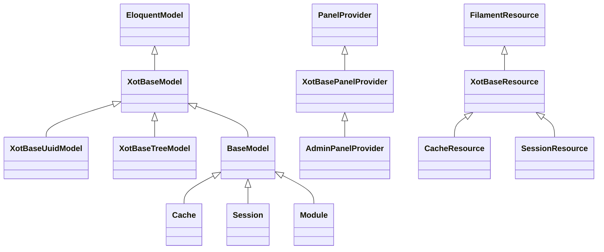

<<<<<<< HEAD
# Xot: il cuore di Laraxot, le classi base che tutti gli altri moduli estendono
=======
<<<<<<< HEAD
> **Version**: 3.0 - DRY + KISS Documentation Refactor
> **Status**: ✅ Core Framework Module
> **Last Updated**: December 2025
>>>>>>> 28b0298a (fix: phpstan issues)

<!-- laraxot:badges:start -->
<!-- laraxot:badges:end -->

> **Sette classi `XotBase*`, duecentoventi Actions e un solo posto dove assorbire gli aggiornamenti di Filament: quarantasette moduli estendono Xot e nessuno estende Filament.**

## In trenta secondi

Xot è il modulo fondamenta. Fornisce `XotBaseModel`, `XotBaseResource`, `XotBasePage`, `XotBaseWidget`, `XotBaseServiceProvider`, `XotBasePanelProvider` e `XotBaseMigration`: ogni altro modulo Laraxot le estende invece di toccare `Filament\*` o `Illuminate\*`. Attorno alle classi base vivono le Actions di utilità (cast sicuri in `Actions/Cast`, chiavi di traduzione con `GetTransKeyAction`, viste per convenzione con `GetViewByClassAction`, export XLS e PDF, branding dei pannelli con `ApplyMetatagToPanelAction`), la configurazione runtime `XotData` e tre pagine di sistema per l'amministratore: `HealthPage`, `EnvPage`, `MetatagPage`.

## Perché esiste

Filament, Livewire e Laravel cambiano API a ogni major. Senza uno strato intermedio ogni aggiornamento andrebbe replicato in ogni modulo. Xot interpone quello strato: `XotBaseResource::form()` e `infolist()` sono `final`, `XotBasePanelProvider::panel()` monta middleware e discovery per tutti, `XotBaseServiceProvider::boot()` registra viste, traduzioni, migrazioni, componenti Livewire e Blade, comandi e asset per convenzione. Un cambio di framework si risolve in `Modules/Xot`, una volta.

## Come funziona

1. Il provider del modulo estende `XotBaseServiceProvider` e dichiara `public string $name`. In `register()` vengono agganciati `Providers\RouteServiceProvider` e `Providers\EventServiceProvider` del modulo e le icone SVG con prefisso `{modulo}::`. In `boot()` partono `registerTranslations()`, `registerConfig()` (ogni `config/*.php` diventa `config('{modulo}.{file}')`), `registerViews()`, `loadMigrationsFrom()`, `registerLivewireComponents()`, `registerBladeComponents()`, `registerCommands()` e `registerPublicAssets()`.
2. Il pannello Filament estende `XotBasePanelProvider` con `protected string $module`: id `{modulo}::admin`, path `{modulo}/admin`, login e reset password attivi, `ApplyMetatagToPanelAction` applica colori, logo e favicon da `MetatagData`, e `discoverResources/Pages/Widgets/Clusters` cerca in `app/Filament/*` del modulo. `$discoverModuleComponents = false` spegne la scoperta per i pannelli esterni.
3. Una risorsa estende `XotBaseResource`: se `$model` è nullo, `getModel()` deduce `Modules\{Modulo}\Models\{Nome}`; `form()` usa `Schemas\{Nome}Form` oppure `getFormSchema()`; `table()` delega a `Tables\{Plurale}Table`, che estende `XotBaseResourceTable` e implementa `getTableColumns()`; `getPages()` cerca `List{Plurale}`, `Create{Nome}`, `Edit{Nome}` e, se esiste, `View{Nome}`; `getRelations()` scansiona la cartella `RelationManagers/`; `getNavigationBadge()` conta i record con `CountAction`.
4. Le etichette non si scrivono nel codice: `TransTrait` e `GetTransKeyAction` costruiscono la chiave `{modulo}::{risorsa}.{campo}` e la leggono da `lang/{locale}/`.
5. Le migrazioni estendono `XotBaseMigration`: la classe del modello si ricava dal nome `create_{tabella}_table`, `tableCreate()` crea solo se la tabella manca, `tableUpdate()` altera in modo idempotente, `updateTimestamps()` aggiunge `created_at`, `updated_at`, `created_by`, `updated_by` (e `deleted_*` se richiesto) solo se assenti.



## Il modello dati

| Modello | Tabella | Relazioni e tratti chiave | Classe base |
|---|---|---|---|
| `XotBaseModel` | (astratta, connessione `xot`) | `HasXotFactory`, `RelationX`, `Updater` (`creator()`, `updater()`, `deleter()` verso il profilo), `$perPage = 30`, cast di `id`, `uuid`, `*_at`, `*_by` | `Illuminate\Database\Eloquent\Model` |
| `XotBaseUuidModel` | (astratta) | `$incrementing = false`, `$keyType = 'string'` | `XotBaseModel` |
| `XotBaseTreeModel` | (astratta) | `HasRecursiveRelationships` (adjacency list), `HasRecursiveRelationshipsContract` | `XotBaseModel` |
| `XotBasePivot`, `XotBaseMorphPivot` | (astratte) | `HasXotFactory`, `Updater` | `Pivot`, `MorphPivot` |
| `Cache`, `CacheLock` | `cache`, `cache_locks` | store cache su database | `BaseModel` |
| `Session` | `sessions` | sessioni utente | `BaseModel` |
| `Extra` | `uuidMorphs('model')` + `extra_attributes` | `SchemalessAttributesTrait`, unico `model_id` + `model_type` | `BaseExtra` |
| `HealthCheckResultHistoryItem` | `health_check_result_history_items` | `check_name`, `status`, `meta`, `batch` di Spatie Health | `BaseHealthCheckResultHistoryItem` |
| `PulseAggregate`, `PulseEntry`, `PulseValue` | `pulse_aggregates`, `pulse_entries`, `pulse_values` | tabelle di Laravel Pulse | `BaseModel` |
| `Module` | in memoria (Sushi) | `getRows()` legge `Module::all()` di nwidart | `BaseModel` |
| `Log` | in memoria (Sushi) | `getRows()` legge `storage/logs/*.log` | `BaseModel` |

## Superpoteri

| Cosa | Dove | Note |
|---|---|---|
| Cast sicuri | `app/Actions/Cast/` | `SafeStringCastAction`, `SafeIntCastAction::execute(mixed $value, ?int $default = 0)`, `SafeFloat`, `SafeBoolean`, `SafeArray`, `SafeEloquent` |
| Convenzioni | `app/Actions/GetTransKeyAction.php`, `app/Actions/View/GetViewByClassAction.php`, `app/Actions/Module/GetModulePathByGeneratorAction.php` | classe → chiave lang, classe → vista, modulo + generator → percorso |
| Modelli | `app/Actions/Model/` (44) e `app/Actions/ModelClass/` (10) | `StoreAction::execute(Model $model, array $data, array $rules)`, `UpdateAction`, `GetAllModelsAction`, `GenerateModelByTableAction`, `CountAction::execute(string $modelClass): int` |
| Pannelli | `app/Actions/Panel/` | `ApplyMetatagToPanelAction::execute(Panel &$panel)`, `ApplyTenancyToPanelAction` (tenant da `XotData::getTenantClass()`) |
| Export e PDF | `app/Actions/Export/`, `app/Actions/Pdf/` | `ExportXlsByCollection`, `ExportXlsByQuery`, `PdfByHtmlAction`, `PdfByViewAction`, `StreamDownloadPdfAction` |
| Traduzioni automatiche | `app/Actions/Translation/` | `DeepLTranslateAction::execute(string $text, string $from, string $to)`, Google, MyMemory, Systran, Apertium |
| Mail | `app/Actions/Mail/` | `SendMailByRecordAction::execute(Model $record, string $mailClass)` |
| Risorse di sistema | `app/Filament/Resources/` | `CacheResource`, `CacheLockResource`, `SessionResource`, `ExtraResource`, `ModuleResource`, `LogResource` |
| Pagine | `app/Filament/Pages/` | `HealthPage` (Spatie Health: database, cache, redis, queue, schedule, disco, debug, cpu), `MetatagPage` (titolo, logo, colori salvati con `SaveTenantConfigAction`), `EnvPage`, `ArtisanCommandsManager`, `MainDashboard` (redirige al pannello del modulo dell'utente) |
| Widget base | `app/Filament/Widgets/` | `XotBaseWidget`, `XotBaseSchemaWidget`, `XotBaseWizardWidget`, `XotBaseChartWidget`, `XotBaseStatsOverviewWidget`, `XotBaseTableWidget`, `XotBaseInfolistWidget` |
| Pagine base | `app/Filament/Resources/Pages/`, `app/Filament/Pages/Auth/`, `app/Filament/Pages/Tenancy/` | `XotBaseListRecords`, `XotBaseCreateRecord`, `XotBaseEditRecord`, `XotBaseViewRecord`, `XotBaseLogin`, `XotBaseRegister`, `XotBaseEditProfile`, `XotBaseRegisterTenant` |
| Helper globali | `helpers/Helper.php` | `inAdmin()`, `authId()`, `xotModel()`, `trans_string()`, `dddx()` |
| Test base | `tests/XotBaseTestCase.php` | `assertDatabaseHasRow()`, `assertDatabaseCountRow()`, `createUnitMock()` |

Comandi artisan reali: `xot:generate-model {model_class}`, `xot:generate-model-class {model_class}`, `xot:generate-form {module}`, `xot:generate-table-columns {module}`, `xot:analyze-components`, `xot:livewire-list`, `xot:view-db-config`, `xot:execute-sql`, `xot:import-mdb-to-mysql`, `xot:parse-print-page {str}`, `filament:generate-resources {module}`, `filament:list-panels`, `db:search-text {search}`, `database:backup`.

## Esempio reale

Da `tests/Unit/Actions/GetTransKeyActionTest.php` e `tests/Unit/Actions/Cast/SafeStringCastActionTest.php`:

```php
$action = app(GetTransKeyAction::class);
$action->execute('Modules\Activity\Actions\LogActivityAction');
// 'activity::log_activity'
$action->execute('Modules\User\Filament\Resources\UserResource\RelationManagers\ProfilesRelationManager');
// 'user::profile'

SafeStringCastAction::cast(456);          // '456'
app(SafeStringCastAction::class)->execute(null); // ''
```

## Numeri veri

<!-- laraxot:metrics:start -->
<!-- laraxot:metrics:end -->

## La visione

Un framework nel framework: poche regole, esplicite, applicate ovunque. Chi apre un modulo Laraxot trova sempre la stessa forma: `Providers\{Nome}ServiceProvider extends XotBaseServiceProvider`, `Filament\Resources\{Nome}Resource extends XotBaseResource`, `Models\{Nome} extends BaseModel`, `lang/it/{nome}.php` per le etichette. La forma uguale è ciò che rende quarantasette moduli leggibili come uno.

## Lo scopo

- Fornire le classi base per modelli, pivot, risorse, pagine, widget, action, provider, pannelli, comandi e migrazioni.
- Offrire Actions di utilità riusabili (`app/Actions`, 39 cartelle) coperte da test in `tests/Unit/Actions`.
- Centralizzare bootstrap e integrazione Filament: `XotServiceProvider` registra timezone, macro (`TextInput::generateSlug`), palette colori, view composer `XotComposer` e redirect SSL.
- Custodire le convenzioni in `docs/` e nelle pagine di filosofia.

## Politica

- `XotBaseResource::form()` e `infolist()` sono `final`: una risorsa dichiara `getFormSchema()` (array con chiavi stringa) o una classe `Schemas\{Nome}Form`, mai `form()`.
- La tabella vive in `Tables\{Plurale}Table extends XotBaseResourceTable` con `getTableColumns()`; se manca, `getTableClass()` lancia `LogicException`.
- `XotBaseServiceProvider::$name` è obbligatorio: se vuoto, `registerViews()` e `registerTranslations()` lanciano eccezione.
- Il pannello di un modulo si chiama `{modulo}::admin` e risponde su `{modulo}/admin`; `$panelId` e `$panelPath` si sovrascrivono solo per pannelli trasversali.
- Le migrazioni usano `tableCreate()` e `tableUpdate()` di `XotBaseMigration`; una tabella, una migrazione; niente `Schema::create` diretto.
- `XotBaseModel` lavora sulla connessione `xot`; `created_by`, `updated_by` e `deleted_by` li riempie il trait `Updater` con `authId()`.
- Le chiavi di traduzione seguono `{modulo}::{risorsa}.{campo}` calcolate da `GetTransKeyAction`.

## Religione

Il credo Laraxot, che gli altri moduli citano per nome:

- **Mai Filament diretto.** Resource → `XotBaseResource`, Page → `XotBasePage`, Widget → `XotBaseWidget` (e `XotBaseChartWidget`, `XotBaseStatsOverviewWidget`, `XotBaseTableWidget`), Action → `XotBaseAction`, List/Create/Edit/View → `XotBaseListRecords`, `XotBaseCreateRecord`, `XotBaseEditRecord`, `XotBaseViewRecord`, PanelProvider → `XotBasePanelProvider`, Dashboard → `XotBaseDashboard`, Login → `XotBaseLogin`.
- **Actions, non Services.** La logica vive in classi `Modules\{Modulo}\Actions\*` con `use QueueableAction` e un metodo `execute()`; niente `app/Services` e niente classi `*Service`. Mai `property_exists()` su un modello Eloquent.
- **`phpstan.neon` è sacro.** Non si modifica, non si aggiungono `ignoreErrors`; gli errori si correggono nel codice.
- **Folio e Volt nel frontoffice, Filament solo nel backoffice.** Le pagine pubbliche stanno in `resources/views/pages` del tema, senza controller e senza rotte in `routes/web.php`.
- **Etichette da file di lingua.** Mai `->label('...')` nel codice: la chiave la calcola `TransTrait`, il testo sta in `lang/{locale}/{risorsa}.php`.
- **Migrazioni da `XotBaseMigration`**, modelli da `XotBaseModel`, provider da `XotBaseServiceProvider`.
- **La cartella `docs` è la memoria**: si legge e si aggiorna prima di scrivere codice.

## Filosofia

DRY e KISS portati alle conseguenze: ogni convenzione vive in un solo file di Xot e vale per tutti. Le classi base non nascondono Filament, lo incanalano: espongono `getFormSchema()`, `getTableColumns()`, `getInfolistSchema()` e lasciano a Xot il resto. `declare(strict_types=1)` e `Webmozart\Assert` ovunque, perché un errore di tipo scoperto a runtime costa più di un'asserzione. "Fix, don't ignore": gli errori si correggono, non si silenziano.

## Zen

Cambia `XotBaseResource` una volta e quarantasette moduli sono già aggiornati: è l'unico aggiornamento che non fa paura.

## Configurazione

| Sorgente | Chiavi | Uso |
|---|---|---|
| `config/config.php` | `name`, `description`, `icon`, `navigation.enabled`, `navigation.sort`, `routes.enabled`, `routes.middleware`, `providers` | metadati del modulo, letti come `config('xot.config')` |
| `config/xot.php` | `paths.base`, `paths.laravel`, `paths.modules`, `paths.docs`, `module_paths.*` | percorsi assoluti dell'host di sviluppo, da sovrascrivere per il proprio ambiente |
| `config/mcp.php` | `servers.filesystem`, `servers.memory`, `servers.fetch`, `servers.mysql` | comandi `npx` dei server MCP usati dagli agenti |
| `XotData::make()` (file tenant `xra.php` via `GetTenantConfigArrayAction`) | `main_module`, `primary_lang`, `pub_theme`, `adm_theme`, `force_ssl`, `super_admin`, `team_class`, `tenant_class`, `membership_class`, `tenant_pivot_class`, `disable_database_notifications` | configurazione runtime condivisa: `getUserClass()`, `getTenantClass()`, `getProfileClass()`, `isSuperAdmin()` |
| `MetatagData::make()` (file tenant `metatag.php`) | `title`, `sitename`, `subtitle`, `author`, `description`, `keywords`, `logo_header`, `logo_header_dark`, `logo_height`, `colors[]` | branding dei pannelli via `ApplyMetatagToPanelAction`, modificabile da `MetatagPage` |

## Quickstart

```bash
php artisan module:enable Xot
./vendor/bin/phpstan analyse Modules/Xot --memory-limit=-1
./vendor/bin/pest Modules/Xot/tests
php artisan filament:list-panels
php artisan filament:generate-resources <Modulo>
```

Per un nuovo modulo: un provider `extends XotBaseServiceProvider` con `public string $name = '<Modulo>'`, un `AdminPanelProvider extends XotBasePanelProvider` con `protected string $module = '<Modulo>'` (vedi `app/Providers/Filament/AdminPanelProvider.php`), modelli `extends BaseModel`, risorse `extends XotBaseResource`, migrazioni `extends XotBaseMigration`.

## Documentazione

Letture di partenza: [docs/philosophy.md](./docs/philosophy.md), [docs/project-religion-politics-zen.md](./docs/project-religion-politics-zen.md), [docs/actions-over-services.md](./docs/actions-over-services.md), [docs/xotbaseresource.md](./docs/xotbaseresource.md), [docs/xotbasepage-implementation.md](./docs/xotbasepage-implementation.md), [docs/xotbasepanelprovider-discovery.md](./docs/xotbasepanelprovider-discovery.md), [docs/migration-base-rules.md](./docs/migration-base-rules.md), [docs/xotdata.md](./docs/xotdata.md), [docs/metatag.md](./docs/metatag.md), [docs/testing/](./docs/testing/).

<!-- laraxot:docs:start -->
<!-- laraxot:docs:end -->

## Ecosistema

Dipendenze da `composer.json`: `nwidart/laravel-modules`, `filament/filament`, `livewire/livewire`, `livewire/volt`, `laravel/folio`, `spatie/laravel-queueable-action`, `spatie/laravel-data`, `spatie/laravel-health`, `spatie/cpu-load-health-check`, `spatie/laravel-permission`, `spatie/laravel-model-states`, `spatie/laravel-schemaless-attributes`, `laravel/pulse`, `maatwebsite/excel`, `spipu/html2pdf`, `staudenmeir/laravel-adjacency-list`, `calebporzio/sushi`, `tightenco/parental`, `thecodingmachine/safe`; il pacchetto locale `packages/coolsam/panel-modules` e il path `../Tenant`.

Moduli Laraxot che Xot richiama direttamente: `User` (`XotData` e `ApplyTenancyToPanelAction` usano `Modules\User\Models\Tenant` e le pagine `Tenancy`), `Tenant` (`SaveTenantConfigAction` in `MetatagPage`), `Media` (`GetAttachmentsSchemaAction` in `XotBaseResource::getAttachmentsSchema()`).

Moduli che estendono Xot (grep su `Modules\Xot\`): Activity, AI, AiAssistant, AsdSoci, Billing, Blog, Bom, Catalog, Cms, Comment, Compliance, Costing, Customer, Dds, Document, Email, Employee, EnergyBroker, Fiscal, Gdpr, Geo, Giveback, HR, Intervention, Inventory, Job, Lang, Media, MetalWork, Notify, Platform, Production, PublicProcurement, Quotation, Rating, Seo, Signage, Signature, Tenant, Thermo, Timber, UI, User, Vehicle, WhatsApp, WorkOrder, Wts.

---

<<<<<<< HEAD
Modulo `Xot` della famiglia **Laraxot**. Badge e numeri si rigenerano con `bash bashscripts/tools/readme/module-readme-badges.sh Xot`; il testo si cura a mano.
=======
**Modulo** `xot` · **Laraxot** · **FixCity Platform** · PHPStan 10 · Filament 5
=======
# Xot: il cuore di Laraxot, le classi base che tutti gli altri moduli estendono

<!-- laraxot:badges:start -->
<!-- laraxot:badges:end -->

> **Sette classi `XotBase*`, duecentoventi Actions e un solo posto dove assorbire gli aggiornamenti di Filament: quarantasette moduli estendono Xot e nessuno estende Filament.**

## In trenta secondi

Xot è il modulo fondamenta. Fornisce `XotBaseModel`, `XotBaseResource`, `XotBasePage`, `XotBaseWidget`, `XotBaseServiceProvider`, `XotBasePanelProvider` e `XotBaseMigration`: ogni altro modulo Laraxot le estende invece di toccare `Filament\*` o `Illuminate\*`. Attorno alle classi base vivono le Actions di utilità (cast sicuri in `Actions/Cast`, chiavi di traduzione con `GetTransKeyAction`, viste per convenzione con `GetViewByClassAction`, export XLS e PDF, branding dei pannelli con `ApplyMetatagToPanelAction`), la configurazione runtime `XotData` e tre pagine di sistema per l'amministratore: `HealthPage`, `EnvPage`, `MetatagPage`.

## Perché esiste

Filament, Livewire e Laravel cambiano API a ogni major. Senza uno strato intermedio ogni aggiornamento andrebbe replicato in ogni modulo. Xot interpone quello strato: `XotBaseResource::form()` e `infolist()` sono `final`, `XotBasePanelProvider::panel()` monta middleware e discovery per tutti, `XotBaseServiceProvider::boot()` registra viste, traduzioni, migrazioni, componenti Livewire e Blade, comandi e asset per convenzione. Un cambio di framework si risolve in `Modules/Xot`, una volta.

## Come funziona

1. Il provider del modulo estende `XotBaseServiceProvider` e dichiara `public string $name`. In `register()` vengono agganciati `Providers\RouteServiceProvider` e `Providers\EventServiceProvider` del modulo e le icone SVG con prefisso `{modulo}::`. In `boot()` partono `registerTranslations()`, `registerConfig()` (ogni `config/*.php` diventa `config('{modulo}.{file}')`), `registerViews()`, `loadMigrationsFrom()`, `registerLivewireComponents()`, `registerBladeComponents()`, `registerCommands()` e `registerPublicAssets()`.
2. Il pannello Filament estende `XotBasePanelProvider` con `protected string $module`: id `{modulo}::admin`, path `{modulo}/admin`, login e reset password attivi, `ApplyMetatagToPanelAction` applica colori, logo e favicon da `MetatagData`, e `discoverResources/Pages/Widgets/Clusters` cerca in `app/Filament/*` del modulo. `$discoverModuleComponents = false` spegne la scoperta per i pannelli esterni.
3. Una risorsa estende `XotBaseResource`: se `$model` è nullo, `getModel()` deduce `Modules\{Modulo}\Models\{Nome}`; `form()` usa `Schemas\{Nome}Form` oppure `getFormSchema()`; `table()` delega a `Tables\{Plurale}Table`, che estende `XotBaseResourceTable` e implementa `getTableColumns()`; `getPages()` cerca `List{Plurale}`, `Create{Nome}`, `Edit{Nome}` e, se esiste, `View{Nome}`; `getRelations()` scansiona la cartella `RelationManagers/`; `getNavigationBadge()` conta i record con `CountAction`.
4. Le etichette non si scrivono nel codice: `TransTrait` e `GetTransKeyAction` costruiscono la chiave `{modulo}::{risorsa}.{campo}` e la leggono da `lang/{locale}/`.
5. Le migrazioni estendono `XotBaseMigration`: la classe del modello si ricava dal nome `create_{tabella}_table`, `tableCreate()` crea solo se la tabella manca, `tableUpdate()` altera in modo idempotente, `updateTimestamps()` aggiunge `created_at`, `updated_at`, `created_by`, `updated_by` (e `deleted_*` se richiesto) solo se assenti.


## Il modello dati

| Modello | Tabella | Relazioni e tratti chiave | Classe base |
|---|---|---|---|
| `XotBaseModel` | (astratta, connessione `xot`) | `HasXotFactory`, `RelationX`, `Updater` (`creator()`, `updater()`, `deleter()` verso il profilo), `$perPage = 30`, cast di `id`, `uuid`, `*_at`, `*_by` | `Illuminate\Database\Eloquent\Model` |
| `XotBaseUuidModel` | (astratta) | `$incrementing = false`, `$keyType = 'string'` | `XotBaseModel` |
| `XotBaseTreeModel` | (astratta) | `HasRecursiveRelationships` (adjacency list), `HasRecursiveRelationshipsContract` | `XotBaseModel` |
| `XotBasePivot`, `XotBaseMorphPivot` | (astratte) | `HasXotFactory`, `Updater` | `Pivot`, `MorphPivot` |
| `Cache`, `CacheLock` | `cache`, `cache_locks` | store cache su database | `BaseModel` |
| `Session` | `sessions` | sessioni utente | `BaseModel` |
| `Extra` | `uuidMorphs('model')` + `extra_attributes` | `SchemalessAttributesTrait`, unico `model_id` + `model_type` | `BaseExtra` |
| `HealthCheckResultHistoryItem` | `health_check_result_history_items` | `check_name`, `status`, `meta`, `batch` di Spatie Health | `BaseHealthCheckResultHistoryItem` |
| `PulseAggregate`, `PulseEntry`, `PulseValue` | `pulse_aggregates`, `pulse_entries`, `pulse_values` | tabelle di Laravel Pulse | `BaseModel` |
| `Module` | in memoria (Sushi) | `getRows()` legge `Module::all()` di nwidart | `BaseModel` |
| `Log` | in memoria (Sushi) | `getRows()` legge `storage/logs/*.log` | `BaseModel` |

## Superpoteri

| Cosa | Dove | Note |
|---|---|---|
| Cast sicuri | `app/Actions/Cast/` | `SafeStringCastAction`, `SafeIntCastAction::execute(mixed $value, ?int $default = 0)`, `SafeFloat`, `SafeBoolean`, `SafeArray`, `SafeEloquent` |
| Convenzioni | `app/Actions/GetTransKeyAction.php`, `app/Actions/View/GetViewByClassAction.php`, `app/Actions/Module/GetModulePathByGeneratorAction.php` | classe → chiave lang, classe → vista, modulo + generator → percorso |
| Modelli | `app/Actions/Model/` (44) e `app/Actions/ModelClass/` (10) | `StoreAction::execute(Model $model, array $data, array $rules)`, `UpdateAction`, `GetAllModelsAction`, `GenerateModelByTableAction`, `CountAction::execute(string $modelClass): int` |
| Pannelli | `app/Actions/Panel/` | `ApplyMetatagToPanelAction::execute(Panel &$panel)`, `ApplyTenancyToPanelAction` (tenant da `XotData::getTenantClass()`) |
| Export e PDF | `app/Actions/Export/`, `app/Actions/Pdf/` | `ExportXlsByCollection`, `ExportXlsByQuery`, `PdfByHtmlAction`, `PdfByViewAction`, `StreamDownloadPdfAction` |
| Traduzioni automatiche | `app/Actions/Translation/` | `DeepLTranslateAction::execute(string $text, string $from, string $to)`, Google, MyMemory, Systran, Apertium |
| Mail | `app/Actions/Mail/` | `SendMailByRecordAction::execute(Model $record, string $mailClass)` |
| Risorse di sistema | `app/Filament/Resources/` | `CacheResource`, `CacheLockResource`, `SessionResource`, `ExtraResource`, `ModuleResource`, `LogResource` |
| Pagine | `app/Filament/Pages/` | `HealthPage` (Spatie Health: database, cache, redis, queue, schedule, disco, debug, cpu), `MetatagPage` (titolo, logo, colori salvati con `SaveTenantConfigAction`), `EnvPage`, `ArtisanCommandsManager`, `MainDashboard` (redirige al pannello del modulo dell'utente) |
| Widget base | `app/Filament/Widgets/` | `XotBaseWidget`, `XotBaseSchemaWidget`, `XotBaseWizardWidget`, `XotBaseChartWidget`, `XotBaseStatsOverviewWidget`, `XotBaseTableWidget`, `XotBaseInfolistWidget` |
| Pagine base | `app/Filament/Resources/Pages/`, `app/Filament/Pages/Auth/`, `app/Filament/Pages/Tenancy/` | `XotBaseListRecords`, `XotBaseCreateRecord`, `XotBaseEditRecord`, `XotBaseViewRecord`, `XotBaseLogin`, `XotBaseRegister`, `XotBaseEditProfile`, `XotBaseRegisterTenant` |
| Helper globali | `helpers/Helper.php` | `inAdmin()`, `authId()`, `xotModel()`, `trans_string()`, `dddx()` |
| Test base | `tests/XotBaseTestCase.php` | `assertDatabaseHasRow()`, `assertDatabaseCountRow()`, `createUnitMock()` |

Comandi artisan reali: `xot:generate-model {model_class}`, `xot:generate-model-class {model_class}`, `xot:generate-form {module}`, `xot:generate-table-columns {module}`, `xot:analyze-components`, `xot:livewire-list`, `xot:view-db-config`, `xot:execute-sql`, `xot:import-mdb-to-mysql`, `xot:parse-print-page {str}`, `filament:generate-resources {module}`, `filament:list-panels`, `db:search-text {search}`, `database:backup`.

## Esempio reale

Da `tests/Unit/Actions/GetTransKeyActionTest.php` e `tests/Unit/Actions/Cast/SafeStringCastActionTest.php`:

```php
$action = app(GetTransKeyAction::class);
$action->execute('Modules\Activity\Actions\LogActivityAction');
// 'activity::log_activity'
$action->execute('Modules\User\Filament\Resources\UserResource\RelationManagers\ProfilesRelationManager');
// 'user::profile'

SafeStringCastAction::cast(456);          // '456'
app(SafeStringCastAction::class)->execute(null); // ''
```

## Numeri veri

<!-- laraxot:metrics:start -->
<!-- laraxot:metrics:end -->

## La visione

Un framework nel framework: poche regole, esplicite, applicate ovunque. Chi apre un modulo Laraxot trova sempre la stessa forma: `Providers\{Nome}ServiceProvider extends XotBaseServiceProvider`, `Filament\Resources\{Nome}Resource extends XotBaseResource`, `Models\{Nome} extends BaseModel`, `lang/it/{nome}.php` per le etichette. La forma uguale è ciò che rende quarantasette moduli leggibili come uno.

## Lo scopo

- Fornire le classi base per modelli, pivot, risorse, pagine, widget, action, provider, pannelli, comandi e migrazioni.
- Offrire Actions di utilità riusabili (`app/Actions`, 39 cartelle) coperte da test in `tests/Unit/Actions`.
- Centralizzare bootstrap e integrazione Filament: `XotServiceProvider` registra timezone, macro (`TextInput::generateSlug`), palette colori, view composer `XotComposer` e redirect SSL.
- Custodire le convenzioni in `docs/` e nelle pagine di filosofia.

## Politica

- `XotBaseResource::form()` e `infolist()` sono `final`: una risorsa dichiara `getFormSchema()` (array con chiavi stringa) o una classe `Schemas\{Nome}Form`, mai `form()`.
- La tabella vive in `Tables\{Plurale}Table extends XotBaseResourceTable` con `getTableColumns()`; se manca, `getTableClass()` lancia `LogicException`.
- `XotBaseServiceProvider::$name` è obbligatorio: se vuoto, `registerViews()` e `registerTranslations()` lanciano eccezione.
- Il pannello di un modulo si chiama `{modulo}::admin` e risponde su `{modulo}/admin`; `$panelId` e `$panelPath` si sovrascrivono solo per pannelli trasversali.
- Le migrazioni usano `tableCreate()` e `tableUpdate()` di `XotBaseMigration`; una tabella, una migrazione; niente `Schema::create` diretto.
- `XotBaseModel` lavora sulla connessione `xot`; `created_by`, `updated_by` e `deleted_by` li riempie il trait `Updater` con `authId()`.
- Le chiavi di traduzione seguono `{modulo}::{risorsa}.{campo}` calcolate da `GetTransKeyAction`.

## Religione

Il credo Laraxot, che gli altri moduli citano per nome:

- **Mai Filament diretto.** Resource → `XotBaseResource`, Page → `XotBasePage`, Widget → `XotBaseWidget` (e `XotBaseChartWidget`, `XotBaseStatsOverviewWidget`, `XotBaseTableWidget`), Action → `XotBaseAction`, List/Create/Edit/View → `XotBaseListRecords`, `XotBaseCreateRecord`, `XotBaseEditRecord`, `XotBaseViewRecord`, PanelProvider → `XotBasePanelProvider`, Dashboard → `XotBaseDashboard`, Login → `XotBaseLogin`.
- **Actions, non Services.** La logica vive in classi `Modules\{Modulo}\Actions\*` con `use QueueableAction` e un metodo `execute()`; niente `app/Services` e niente classi `*Service`. Mai `property_exists()` su un modello Eloquent.
- **`phpstan.neon` è sacro.** Non si modifica, non si aggiungono `ignoreErrors`; gli errori si correggono nel codice.
- **Folio e Volt nel frontoffice, Filament solo nel backoffice.** Le pagine pubbliche stanno in `resources/views/pages` del tema, senza controller e senza rotte in `routes/web.php`.
- **Etichette da file di lingua.** Mai `->label('...')` nel codice: la chiave la calcola `TransTrait`, il testo sta in `lang/{locale}/{risorsa}.php`.
- **Migrazioni da `XotBaseMigration`**, modelli da `XotBaseModel`, provider da `XotBaseServiceProvider`.
- **La cartella `docs` è la memoria**: si legge e si aggiorna prima di scrivere codice.

## Filosofia

DRY e KISS portati alle conseguenze: ogni convenzione vive in un solo file di Xot e vale per tutti. Le classi base non nascondono Filament, lo incanalano: espongono `getFormSchema()`, `getTableColumns()`, `getInfolistSchema()` e lasciano a Xot il resto. `declare(strict_types=1)` e `Webmozart\Assert` ovunque, perché un errore di tipo scoperto a runtime costa più di un'asserzione. "Fix, don't ignore": gli errori si correggono, non si silenziano.

## Zen

Cambia `XotBaseResource` una volta e quarantasette moduli sono già aggiornati: è l'unico aggiornamento che non fa paura.

## Configurazione

| Sorgente | Chiavi | Uso |
|---|---|---|
| `config/config.php` | `name`, `description`, `icon`, `navigation.enabled`, `navigation.sort`, `routes.enabled`, `routes.middleware`, `providers` | metadati del modulo, letti come `config('xot.config')` |
| `config/xot.php` | `paths.base`, `paths.laravel`, `paths.modules`, `paths.docs`, `module_paths.*` | percorsi assoluti dell'host di sviluppo, da sovrascrivere per il proprio ambiente |
| `config/mcp.php` | `servers.filesystem`, `servers.memory`, `servers.fetch`, `servers.mysql` | comandi `npx` dei server MCP usati dagli agenti |
| `XotData::make()` (file tenant `xra.php` via `GetTenantConfigArrayAction`) | `main_module`, `primary_lang`, `pub_theme`, `adm_theme`, `force_ssl`, `super_admin`, `team_class`, `tenant_class`, `membership_class`, `tenant_pivot_class`, `disable_database_notifications` | configurazione runtime condivisa: `getUserClass()`, `getTenantClass()`, `getProfileClass()`, `isSuperAdmin()` |
| `MetatagData::make()` (file tenant `metatag.php`) | `title`, `sitename`, `subtitle`, `author`, `description`, `keywords`, `logo_header`, `logo_header_dark`, `logo_height`, `colors[]` | branding dei pannelli via `ApplyMetatagToPanelAction`, modificabile da `MetatagPage` |

## Quickstart

```bash
php artisan module:enable Xot
./vendor/bin/phpstan analyse Modules/Xot --memory-limit=-1
./vendor/bin/pest Modules/Xot/tests
php artisan filament:list-panels
php artisan filament:generate-resources <Modulo>
```

Per un nuovo modulo: un provider `extends XotBaseServiceProvider` con `public string $name = '<Modulo>'`, un `AdminPanelProvider extends XotBasePanelProvider` con `protected string $module = '<Modulo>'` (vedi `app/Providers/Filament/AdminPanelProvider.php`), modelli `extends BaseModel`, risorse `extends XotBaseResource`, migrazioni `extends XotBaseMigration`.

## Documentazione

Letture di partenza: [docs/philosophy.md](./docs/philosophy.md), [docs/project-religion-politics-zen.md](./docs/project-religion-politics-zen.md), [docs/actions-over-services.md](./docs/actions-over-services.md), [docs/xotbaseresource.md](./docs/xotbaseresource.md), [docs/xotbasepage-implementation.md](./docs/xotbasepage-implementation.md), [docs/xotbasepanelprovider-discovery.md](./docs/xotbasepanelprovider-discovery.md), [docs/migration-base-rules.md](./docs/migration-base-rules.md), [docs/xotdata.md](./docs/xotdata.md), [docs/metatag.md](./docs/metatag.md), [docs/testing/](./docs/testing/).

<!-- laraxot:docs:start -->
<!-- laraxot:docs:end -->

## Ecosistema

Dipendenze da `composer.json`: `nwidart/laravel-modules`, `filament/filament`, `livewire/livewire`, `livewire/volt`, `laravel/folio`, `spatie/laravel-queueable-action`, `spatie/laravel-data`, `spatie/laravel-health`, `spatie/cpu-load-health-check`, `spatie/laravel-permission`, `spatie/laravel-model-states`, `spatie/laravel-schemaless-attributes`, `laravel/pulse`, `maatwebsite/excel`, `spipu/html2pdf`, `staudenmeir/laravel-adjacency-list`, `calebporzio/sushi`, `tightenco/parental`, `thecodingmachine/safe`; il pacchetto locale `packages/coolsam/panel-modules` e il path `../Tenant`.

Moduli Laraxot che Xot richiama direttamente: `User` (`XotData` e `ApplyTenancyToPanelAction` usano `Modules\User\Models\Tenant` e le pagine `Tenancy`), `Tenant` (`SaveTenantConfigAction` in `MetatagPage`), `Media` (`GetAttachmentsSchemaAction` in `XotBaseResource::getAttachmentsSchema()`).

Moduli che estendono Xot (grep su `Modules\Xot\`): Activity, AI, AiAssistant, AsdSoci, Billing, Blog, Bom, Catalog, Cms, Comment, Compliance, Costing, Customer, Dds, Document, Email, Employee, EnergyBroker, Fiscal, Gdpr, Geo, Giveback, HR, Intervention, Inventory, Job, Lang, Media, MetalWork, Notify, Platform, Production, PublicProcurement, Quotation, Rating, Seo, Signage, Signature, Tenant, Thermo, Timber, UI, User, Vehicle, WhatsApp, WorkOrder, Wts.

---

Modulo `Xot` della famiglia **Laraxot**. Badge e numeri si rigenerano con `bash bashscripts/tools/readme/module-readme-badges.sh Xot`; il testo si cura a mano.
>>>>>>> 7f6cf6be (.)
>>>>>>> 28b0298a (fix: phpstan issues)
