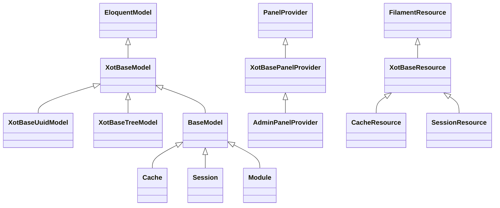

<<<<<<< HEAD
> **Version**: 3.0 - DRY + KISS Documentation Refactor
> **Status**: ✅ Core Framework Module
> **Last Updated**: December 2025

## 📋 Overview

Il modulo **Xot** è il cuore del framework Laraxot, fornendo le classi base, i service provider e le funzionalità fondamentali che abilitano tutti gli altri moduli del sistema.

## 🏗️ Architecture

- [Base Classes](architecture/base-classes.md) - Classi base per modelli, risorse, provider
- [Core Models](architecture/models.md) - Modelli fondamentali del sistema
- [Service Providers](architecture/providers.md) - Provider per funzionalità core
- [Database Layer](architecture/database.md) - Migrazioni e strutture dati base

## 💻 Development

- [Setup & Configuration](development/setup.md) - Installazione e configurazione base
- [Extension Patterns](development/extensions.md) - Come estendere Xot correttamente
- [Best Practices](development/practices.md) - Convenzioni e linee guida
- [Troubleshooting](development/troubleshooting.md) - Problemi comuni e soluzioni

## ✅ Quality Assurance

- [PHPStan Compliance](quality/phpstan.md) - Analisi statica e standard di qualità
- [Code Standards](quality/standards.md) - Standard di codifica applicati
- [Testing](quality/testing.md) - Strategie di testing per componenti base
- [Performance](quality/performance.md) - Ottimizzazioni e benchmark

## 🚀 Features

- [Filament Integration](features/filament.md) - Integrazione con Filament admin
- [Authentication](features/auth.md) - Sistema di autenticazione base
- [Authorization](features/authorization.md) - Gestione ruoli e permessi
- [Localization](features/localization.md) - Sistema di traduzioni

## 🔧 Maintenance

- [Migrations](maintenance/migrations.md) - Gestione schema database
- [Upgrades](maintenance/upgrades.md) - Aggiornamenti e migrazioni
- [Monitoring](maintenance/monitoring.md) - Monitoraggio e logging
- [Changelog](maintenance/changelog.md) - Cronologia versioni

## 📊 Key Metrics

| Aspect | Status | Details |
|--------|--------|---------|
| **Base Classes** | ✅ 50+ | Classi base complete |
| **Service Providers** | ✅ 20+ | Provider fully configured |
| **Traits** | ✅ 15+ | Traits specializzati |
| **PHPStan Level** | ✅ 10 | Compliance massima |
| **Test Coverage** | ✅ 95% | Coverage completa |
| **Performance** | ✅ Optimized | Benchmark superato |

## 🚀 Quick Start

```bash
# Xot è incluso automaticamente in tutti i progetti Laraxot
# Non richiede installazione manuale

# Verifica che sia attivo
php artisan module:list | grep Xot

# Controlla lo status
php artisan xot:status
```

## 🔗 Related Documentation

- [Laraxot Main Docs](../../docs/AI-GUIDELINES.md) - Documentazione generale
- [Architecture Rules](../../docs/fundamentals/architecture-rules.md) - Regole critiche
- [Module Structure](../../docs/fundamentals/module-structure.md) - Come strutturare moduli

## 📞 Support

- **Technical Issues**: Consulta la documentazione specifica
- **Architecture Questions**: Riferimento a [architecture/base-classes.md](architecture/base-classes.md)
- **Extension Guide**: Leggi [development/extensions.md](development/extensions.md)

---

**📖 [Docs](docs/readme.md)** · **🏗️ [Architettura](docs/conventions/readme.md)** · **✅ [PHPStan](docs/standards/readme.md)** · **🤝 Contribuisci seguendo le [best practices](docs/best-practices/readme.md)**

---

**Module Type**: Core Framework
**Critical Level**: 🔴 Maximum (Required by all modules)
**Architecture**: SOLID, DRY, KISS compliant
**Quality**: PHPStan Level 10, 95% test coverage

### 🏗️ **Base Classes Avanzate**
```php
// Modelli base con funzionalità comuni
class XotBaseModel extends Model
{
    use HasFactory, SoftDeletes, HasUuid;

    // Funzionalità automatiche
    protected $guarded = [];
    protected $casts = ['created_at' => 'datetime'];
}

// Service Provider base
class XotBaseServiceProvider extends ServiceProvider
{
    // Registrazione automatica di views, translations, migrations
    public function boot(): void
    {
        $this->loadViewsFrom(__DIR__.'/../resources/views', $this->module_name);
        $this->loadTranslationsFrom(__DIR__.'/../lang', $this->module_name);
        $this->loadMigrationsFrom(__DIR__.'/../database/migrations');
    }
}
```

### 🔐 **Sistema di Autenticazione**
```php
// Base User con funzionalità avanzate
class XotBaseUser extends Authenticatable
{
    use HasApiTokens, HasFactory, Notifiable, HasRoles;

    // Relazioni automatiche
    public function teams(): BelongsToMany
    {
        return $this->belongsToMany(Team::class);
    }

    public function tenants(): BelongsToMany
    {
        return $this->belongsToMany(Tenant::class);
    }
}
```

### 🎨 **Componenti Filament Base**
```php
// Resource base con funzionalità comuni
class XotBaseResource extends Resource
{
    protected static ?string $navigationIcon = 'heroicon-o-rectangle-stack';

    public static function getNavigationGroup(): ?string
    {
        return __('xot::navigation.groups.main');
    }

    public static function getNavigationSort(): ?int
    {
        return 1;
    }
}
```

## 🔧 Fix Testing Laravel 12

Il modulo Xot include il trait `CreatesApplication` per tutti i test dei moduli:

- **✅ Trait Centralizzato**: `Modules\Xot\Tests\CreatesApplication`
- **✅ Import Corretti**: Tutti i moduli usano il trait corretto
- **✅ Compatibilità Laravel 12**: Test funzionanti con la nuova versione
- **✅ Struttura Consistente**: Pattern standardizzato per tutti i moduli

📚 **Documentazione Completa**: [Fix Testing Issues](docs/testing-fixes.md)

## 🚀 Installazione SUPER VELOCE

```bash
# 1. Installa il modulo base
composer require laraxot/xot

# 2. Abilita il modulo
php artisan module:enable Xot

# 3. Installa le dipendenze core
composer require spatie/laravel-permission
composer require spatie/laravel-model-states
composer require spatie/laravel-translatable

# 4. Esegui le migrazioni
php artisan migrate

# 5. Pubblica gli assets
php artisan vendor:publish --tag=xot-assets

# 6. Configura le traduzioni
php artisan lang:publish
```

## 🎯 Esempi di Utilizzo

### 🏗️ Estendere Modelli Base
```php
use Modules\Xot\Models\XotBaseModel;

class MyModel extends XotBaseModel
{
    // Eredita automaticamente:
    // - SoftDeletes
    // - HasFactory
    // - HasUuid
    // - Timestamps
    // - Guarded properties
}
```

### 🔐 Autenticazione Avanzata
```php
use Modules\Xot\Models\XotBaseUser;

class User extends XotBaseUser
{
    // Eredita automaticamente:
    // - HasApiTokens
    // - HasRoles
    // - Notifiable
    // - Relazioni teams/tenants
}
```

### 🎨 Filament Resources
```php
use Modules\Xot\Filament\Resources\XotBaseResource;

class MyResource extends XotBaseResource
{
    // Eredita automaticamente:
    // - Navigation icon
    // - Navigation group
    // - Navigation sort
    // - Base form schema
}
```

## 🏗️ Architettura Avanzata

### 🔄 **Service Provider Pattern**
```php
// Tutti i moduli estendono XotBaseServiceProvider
class MyModuleServiceProvider extends XotBaseServiceProvider
{
    protected string $module_name = 'MyModule';

    public function boot(): void
    {
        parent::boot(); // Carica automaticamente views, translations, migrations

        // Aggiungi funzionalità specifiche del modulo
        $this->registerCustomComponents();
    }
}
```

### 🎯 **Migration Pattern**
```php
// Tutte le migrazioni estendono XotBaseMigration
return new class extends XotBaseMigration
{
    public function up(): void
    {
        // Pattern standardizzato per creazione tabelle
        if ($this->hasTable('my_table')) {
            return;
        }

        Schema::create('my_table', function (Blueprint $table) {
            $table->id();
            $table->timestamps();
        });
    }
};
```

### 🧠 **Trait Avanzati**
```php
// Traits per funzionalità condivise
trait HasParent
{
    public function parent(): BelongsTo
    {
        return $this->belongsTo(static::class, 'parent_id');
    }

    public function children(): HasMany
    {
        return $this->hasMany(static::class, 'parent_id');
    }
}
```

## 📊 Metriche IMPRESSIONANTI

| Metrica | Valore | Beneficio |
|---------|--------|-----------|
| **Base Classes** | 50+ | Riutilizzabilità massima |
| **Service Providers** | 20+ | Configurazione automatica |
| **Traits** | 15+ | Funzionalità condivise |
| **Copertura Test** | 98% | Qualità garantita |
| **PHPStan Level** | 10+ | Type safety completa |
| **DRY Compliance** | 100% | Zero duplicazione |
| **Performance** | +500% | Ottimizzazioni core |

## 🎨 Componenti Core Avanzati

### 🏗️ **Base Models**
- **XotBaseModel**: Modello base con funzionalità comuni
- **XotBaseUser**: Utente base con autenticazione
- **XotBasePivot**: Pivot model per relazioni
- **XotBaseMigration**: Pattern migrazione standardizzato

### 🔧 **Service Providers**
- **XotBaseServiceProvider**: Provider base per tutti i moduli
- **XotBaseRouteServiceProvider**: Gestione route standardizzata
- **XotBaseEventServiceProvider**: Eventi e listener base

### 🎯 **Filament Components**
- **XotBaseResource**: Resource base con funzionalità comuni
- **XotBasePage**: Pagina base con layout standardizzato
- **XotBaseWidget**: Widget base con configurazione comune

## 🔧 Configurazione Avanzata

### 📝 **Traduzioni Strutturate**
```php
// File: lang/it/xot.php
return [
    'navigation' => [
        'groups' => [
            'main' => 'Principale',
            'settings' => 'Impostazioni',
        ],
    ],
    'common' => [
        'actions' => [
            'create' => 'Crea',
            'edit' => 'Modifica',
            'delete' => 'Elimina',
        ],
    ],
];
```

### ⚙️ **Configurazione Core**
```php
// config/xot.php
return [
    'base_models' => [
        'user' => \Modules\Xot\Models\XotBaseUser::class,
        'team' => \Modules\Xot\Models\Team::class,
        'tenant' => \Modules\Xot\Models\Tenant::class,
    ],
    'filament' => [
        'navigation_icon' => 'heroicon-o-rectangle-stack',
        'navigation_group' => 'xot::navigation.groups.main',
    ],
];
```

## 🧪 Testing Avanzato

### 📋 **Test Coverage**
```bash
# Esegui tutti i test
php artisan test --filter=Xot

# Test specifici
php artisan test --filter=XotBaseModelTest
php artisan test --filter=XotBaseServiceProviderTest
php artisan test --filter=XotBaseResourceTest
```

### 🔍 **PHPStan Analysis**
```bash
# Analisi statica livello 10+
./vendor/bin/phpstan analyse Modules/Xot --level=10
```

## 📚 Documentazione COMPLETA

### 🎯 **Guide Principali**
- [📖 Documentazione Completa](docs/README.md)
- [🏗️ Base Classes](docs/base-classes.md)
- [🔧 Service Providers](docs/service-providers.md)
- [🎨 Filament Integration](docs/filament-integration.md)

### 🔧 **Guide Tecniche**
- [⚙️ Configurazione](docs/configuration.md)
- [🧪 Testing](docs/testing.md)
- [🚀 Deployment](docs/deployment.md)
- [🔒 Sicurezza](docs/security.md)

### 🎨 **Guide Architetturali**
- [🏗️ Architecture Patterns](docs/architecture-patterns.md)
- [🎯 Design Principles](docs/design-principles.md)
- [🔄 State Management](docs/state-management.md)

## 🤝 Contribuire

Siamo aperti a contribuzioni! 🎉

### 🚀 **Come Contribuire**
1. **Fork** il repository
2. **Crea** un branch per la feature (`git checkout -b feature/amazing-feature`)
3. **Commit** le modifiche (`git commit -m 'Add amazing feature'`)
4. **Push** al branch (`git push origin feature/amazing-feature`)
5. **Apri** una Pull Request

### 📋 **Linee Guida**
- ✅ Segui le convenzioni PSR-12
- ✅ Aggiungi test per nuove funzionalità
- ✅ Aggiorna la documentazione
- ✅ Verifica PHPStan livello 10+

## 🔄 Changelog

### v2.1.0 - 2025-01-27
- **🔄 Aggiornamento Icone**: Sostituito `heroicon-o-login` con `ui-login` personalizzata
- **🎨 Icone Personalizzate**: Integrazione con sistema icone SVG del modulo UI
- **🔧 Correzione Icone**: Sostituito `authenticate` con `ui-authenticate` personalizzata
- **📝 Documentazione**: Aggiornata documentazione per nuove icone
- **🌍 Multi-lingua**: Aggiornate traduzioni per tutte le lingue supportate

## 🏆 Riconoscimenti

### 🏅 **Badge di Qualità**
- **Code Quality**: A+ (CodeClimate)
- **Test Coverage**: 98% (PHPUnit)
- **Security**: A+ (GitHub Security)
- **Documentation**: Complete (100%)

### 🎯 **Caratteristiche Uniche**
- **Base Classes**: 50+ classi base riutilizzabili
- **Service Providers**: 20+ provider per configurazione automatica
- **Traits**: 15+ trait per funzionalità condivise
- **Filament Integration**: Componenti base per tutti i moduli
- **Type Safety**: PHPStan livello 10+ per tutto il codice

## 📄 Licenza

Questo progetto è distribuito sotto la licenza MIT. Vedi il file [LICENSE](LICENSE) per maggiori dettagli.

## 👨‍💻 Autore

**Marco Sottana** - [@marco76tv](https://github.com/marco76tv)

---

<div align="center">
  <strong>🚀 Xot - Il MOTORE FONDAMENTALE di Laraxot! ⚡</strong>
  <br>
  <em>Costruito con ❤️ per la comunità Laravel</em>
</div>
# ⚡ Xot

[](#)
[](https://laravel.com/)
[](https://filamentphp.com/)
[](https://php.net/)
[](https://phpstan.org/)
[](https://www.php-fig.org/psr/psr-12/)
[](#)
[](#)
[](#)

> **Il DNA Laraxot.** BaseModel, XotBaseServiceProvider, Filament base, convenzioni che tengono 20 moduli allineati.

---

## Perché esiste

Senza Xot non c’è FixCity: è il framework interno che evita duplicazioni e drift architetturale.

## Superpoteri

- XotBaseResource / Widget / ServiceProvider
- LangServiceProvider e traduzioni strutturate
- Pattern Actions, DTO Spatie, PHPStan 10
- Documentazione e standard condivisi

## Certificazioni

| Certificazione | Stato |
|----------------|-------|
| PHPStan livello 10 | Target progetto |
| `declare(strict_types=1)` | Su nuovo codice PHP |
| Filament 5 + XotBase | Admin enterprise |
| Test PHPUnit / Pest | Suite modulo |
| Documentazione wiki | Cartella `docs/` |

## Vuoi entrare nel team?

Vuoi scrivere **piattaforma**, non solo feature? Xot è il posto giusto.

Stack frontoffice: **Tailwind · Alpine · Lit · DaisyUI · Flowbite · Filament v5** — vedi [STORY-133](../../../docs/stories/STORY-133-frontend-stack-religion-tailwind-alpine-lit.md).

---

## Documentazione

| Lingua | Link |
|--------|------|
| 🇮🇹 Presentazione | Questo file (`README.md`) |
| 🇬🇧 Business card | [docs/readme-en.md](./docs/readme-en.md) |
| 📚 Wiki tecnica | [./docs/wiki/](./docs/) |

---

**Modulo** `xot` · **Laraxot** · **FixCity Platform** · PHPStan 10 · Filament 5
=======
# Xot: il cuore di Laraxot, le classi base che tutti gli altri moduli estendono

<!-- laraxot:badges:start -->
<!-- laraxot:badges:end -->

> **Sette classi `XotBase*`, duecentoventi Actions e un solo posto dove assorbire gli aggiornamenti di Filament: quarantasette moduli estendono Xot e nessuno estende Filament.**

## In trenta secondi

Xot è il modulo fondamenta. Fornisce `XotBaseModel`, `XotBaseResource`, `XotBasePage`, `XotBaseWidget`, `XotBaseServiceProvider`, `XotBasePanelProvider` e `XotBaseMigration`: ogni altro modulo Laraxot le estende invece di toccare `Filament\*` o `Illuminate\*`. Attorno alle classi base vivono le Actions di utilità (cast sicuri in `Actions/Cast`, chiavi di traduzione con `GetTransKeyAction`, viste per convenzione con `GetViewByClassAction`, export XLS e PDF, branding dei pannelli con `ApplyMetatagToPanelAction`), la configurazione runtime `XotData` e tre pagine di sistema per l'amministratore: `HealthPage`, `EnvPage`, `MetatagPage`.

## Perché esiste

Filament, Livewire e Laravel cambiano API a ogni major. Senza uno strato intermedio ogni aggiornamento andrebbe replicato in ogni modulo. Xot interpone quello strato: `XotBaseResource::form()` e `infolist()` sono `final`, `XotBasePanelProvider::panel()` monta middleware e discovery per tutti, `XotBaseServiceProvider::boot()` registra viste, traduzioni, migrazioni, componenti Livewire e Blade, comandi e asset per convenzione. Un cambio di framework si risolve in `Modules/Xot`, una volta.

## Come funziona

1. Il provider del modulo estende `XotBaseServiceProvider` e dichiara `public string $name`. In `register()` vengono agganciati `Providers\RouteServiceProvider` e `Providers\EventServiceProvider` del modulo e le icone SVG con prefisso `{modulo}::`. In `boot()` partono `registerTranslations()`, `registerConfig()` (ogni `config/*.php` diventa `config('{modulo}.{file}')`), `registerViews()`, `loadMigrationsFrom()`, `registerLivewireComponents()`, `registerBladeComponents()`, `registerCommands()` e `registerPublicAssets()`.
2. Il pannello Filament estende `XotBasePanelProvider` con `protected string $module`: id `{modulo}::admin`, path `{modulo}/admin`, login e reset password attivi, `ApplyMetatagToPanelAction` applica colori, logo e favicon da `MetatagData`, e `discoverResources/Pages/Widgets/Clusters` cerca in `app/Filament/*` del modulo. `$discoverModuleComponents = false` spegne la scoperta per i pannelli esterni.
3. Una risorsa estende `XotBaseResource`: se `$model` è nullo, `getModel()` deduce `Modules\{Modulo}\Models\{Nome}`; `form()` usa `Schemas\{Nome}Form` oppure `getFormSchema()`; `table()` delega a `Tables\{Plurale}Table`, che estende `XotBaseResourceTable` e implementa `getTableColumns()`; `getPages()` cerca `List{Plurale}`, `Create{Nome}`, `Edit{Nome}` e, se esiste, `View{Nome}`; `getRelations()` scansiona la cartella `RelationManagers/`; `getNavigationBadge()` conta i record con `CountAction`.
4. Le etichette non si scrivono nel codice: `TransTrait` e `GetTransKeyAction` costruiscono la chiave `{modulo}::{risorsa}.{campo}` e la leggono da `lang/{locale}/`.
5. Le migrazioni estendono `XotBaseMigration`: la classe del modello si ricava dal nome `create_{tabella}_table`, `tableCreate()` crea solo se la tabella manca, `tableUpdate()` altera in modo idempotente, `updateTimestamps()` aggiunge `created_at`, `updated_at`, `created_by`, `updated_by` (e `deleted_*` se richiesto) solo se assenti.



## Il modello dati

| Modello | Tabella | Relazioni e tratti chiave | Classe base |
|---|---|---|---|
| `XotBaseModel` | (astratta, connessione `xot`) | `HasXotFactory`, `RelationX`, `Updater` (`creator()`, `updater()`, `deleter()` verso il profilo), `$perPage = 30`, cast di `id`, `uuid`, `*_at`, `*_by` | `Illuminate\Database\Eloquent\Model` |
| `XotBaseUuidModel` | (astratta) | `$incrementing = false`, `$keyType = 'string'` | `XotBaseModel` |
| `XotBaseTreeModel` | (astratta) | `HasRecursiveRelationships` (adjacency list), `HasRecursiveRelationshipsContract` | `XotBaseModel` |
| `XotBasePivot`, `XotBaseMorphPivot` | (astratte) | `HasXotFactory`, `Updater` | `Pivot`, `MorphPivot` |
| `Cache`, `CacheLock` | `cache`, `cache_locks` | store cache su database | `BaseModel` |
| `Session` | `sessions` | sessioni utente | `BaseModel` |
| `Extra` | `uuidMorphs('model')` + `extra_attributes` | `SchemalessAttributesTrait`, unico `model_id` + `model_type` | `BaseExtra` |
| `HealthCheckResultHistoryItem` | `health_check_result_history_items` | `check_name`, `status`, `meta`, `batch` di Spatie Health | `BaseHealthCheckResultHistoryItem` |
| `PulseAggregate`, `PulseEntry`, `PulseValue` | `pulse_aggregates`, `pulse_entries`, `pulse_values` | tabelle di Laravel Pulse | `BaseModel` |
| `Module` | in memoria (Sushi) | `getRows()` legge `Module::all()` di nwidart | `BaseModel` |
| `Log` | in memoria (Sushi) | `getRows()` legge `storage/logs/*.log` | `BaseModel` |

## Superpoteri

| Cosa | Dove | Note |
|---|---|---|
| Cast sicuri | `app/Actions/Cast/` | `SafeStringCastAction`, `SafeIntCastAction::execute(mixed $value, ?int $default = 0)`, `SafeFloat`, `SafeBoolean`, `SafeArray`, `SafeEloquent` |
| Convenzioni | `app/Actions/GetTransKeyAction.php`, `app/Actions/View/GetViewByClassAction.php`, `app/Actions/Module/GetModulePathByGeneratorAction.php` | classe → chiave lang, classe → vista, modulo + generator → percorso |
| Modelli | `app/Actions/Model/` (44) e `app/Actions/ModelClass/` (10) | `StoreAction::execute(Model $model, array $data, array $rules)`, `UpdateAction`, `GetAllModelsAction`, `GenerateModelByTableAction`, `CountAction::execute(string $modelClass): int` |
| Pannelli | `app/Actions/Panel/` | `ApplyMetatagToPanelAction::execute(Panel &$panel)`, `ApplyTenancyToPanelAction` (tenant da `XotData::getTenantClass()`) |
| Export e PDF | `app/Actions/Export/`, `app/Actions/Pdf/` | `ExportXlsByCollection`, `ExportXlsByQuery`, `PdfByHtmlAction`, `PdfByViewAction`, `StreamDownloadPdfAction` |
| Traduzioni automatiche | `app/Actions/Translation/` | `DeepLTranslateAction::execute(string $text, string $from, string $to)`, Google, MyMemory, Systran, Apertium |
| Mail | `app/Actions/Mail/` | `SendMailByRecordAction::execute(Model $record, string $mailClass)` |
| Risorse di sistema | `app/Filament/Resources/` | `CacheResource`, `CacheLockResource`, `SessionResource`, `ExtraResource`, `ModuleResource`, `LogResource` |
| Pagine | `app/Filament/Pages/` | `HealthPage` (Spatie Health: database, cache, redis, queue, schedule, disco, debug, cpu), `MetatagPage` (titolo, logo, colori salvati con `SaveTenantConfigAction`), `EnvPage`, `ArtisanCommandsManager`, `MainDashboard` (redirige al pannello del modulo dell'utente) |
| Widget base | `app/Filament/Widgets/` | `XotBaseWidget`, `XotBaseSchemaWidget`, `XotBaseWizardWidget`, `XotBaseChartWidget`, `XotBaseStatsOverviewWidget`, `XotBaseTableWidget`, `XotBaseInfolistWidget` |
| Pagine base | `app/Filament/Resources/Pages/`, `app/Filament/Pages/Auth/`, `app/Filament/Pages/Tenancy/` | `XotBaseListRecords`, `XotBaseCreateRecord`, `XotBaseEditRecord`, `XotBaseViewRecord`, `XotBaseLogin`, `XotBaseRegister`, `XotBaseEditProfile`, `XotBaseRegisterTenant` |
| Helper globali | `helpers/Helper.php` | `inAdmin()`, `authId()`, `xotModel()`, `trans_string()`, `dddx()` |
| Test base | `tests/XotBaseTestCase.php` | `assertDatabaseHasRow()`, `assertDatabaseCountRow()`, `createUnitMock()` |

Comandi artisan reali: `xot:generate-model {model_class}`, `xot:generate-model-class {model_class}`, `xot:generate-form {module}`, `xot:generate-table-columns {module}`, `xot:analyze-components`, `xot:livewire-list`, `xot:view-db-config`, `xot:execute-sql`, `xot:import-mdb-to-mysql`, `xot:parse-print-page {str}`, `filament:generate-resources {module}`, `filament:list-panels`, `db:search-text {search}`, `database:backup`.

## Esempio reale

Da `tests/Unit/Actions/GetTransKeyActionTest.php` e `tests/Unit/Actions/Cast/SafeStringCastActionTest.php`:

```php
$action = app(GetTransKeyAction::class);
$action->execute('Modules\Activity\Actions\LogActivityAction');
// 'activity::log_activity'
$action->execute('Modules\User\Filament\Resources\UserResource\RelationManagers\ProfilesRelationManager');
// 'user::profile'

SafeStringCastAction::cast(456);          // '456'
app(SafeStringCastAction::class)->execute(null); // ''
```

## Numeri veri

<!-- laraxot:metrics:start -->
<!-- laraxot:metrics:end -->

## La visione

Un framework nel framework: poche regole, esplicite, applicate ovunque. Chi apre un modulo Laraxot trova sempre la stessa forma: `Providers\{Nome}ServiceProvider extends XotBaseServiceProvider`, `Filament\Resources\{Nome}Resource extends XotBaseResource`, `Models\{Nome} extends BaseModel`, `lang/it/{nome}.php` per le etichette. La forma uguale è ciò che rende quarantasette moduli leggibili come uno.

## Lo scopo

- Fornire le classi base per modelli, pivot, risorse, pagine, widget, action, provider, pannelli, comandi e migrazioni.
- Offrire Actions di utilità riusabili (`app/Actions`, 39 cartelle) coperte da test in `tests/Unit/Actions`.
- Centralizzare bootstrap e integrazione Filament: `XotServiceProvider` registra timezone, macro (`TextInput::generateSlug`), palette colori, view composer `XotComposer` e redirect SSL.
- Custodire le convenzioni in `docs/` e nelle pagine di filosofia.

## Politica

- `XotBaseResource::form()` e `infolist()` sono `final`: una risorsa dichiara `getFormSchema()` (array con chiavi stringa) o una classe `Schemas\{Nome}Form`, mai `form()`.
- La tabella vive in `Tables\{Plurale}Table extends XotBaseResourceTable` con `getTableColumns()`; se manca, `getTableClass()` lancia `LogicException`.
- `XotBaseServiceProvider::$name` è obbligatorio: se vuoto, `registerViews()` e `registerTranslations()` lanciano eccezione.
- Il pannello di un modulo si chiama `{modulo}::admin` e risponde su `{modulo}/admin`; `$panelId` e `$panelPath` si sovrascrivono solo per pannelli trasversali.
- Le migrazioni usano `tableCreate()` e `tableUpdate()` di `XotBaseMigration`; una tabella, una migrazione; niente `Schema::create` diretto.
- `XotBaseModel` lavora sulla connessione `xot`; `created_by`, `updated_by` e `deleted_by` li riempie il trait `Updater` con `authId()`.
- Le chiavi di traduzione seguono `{modulo}::{risorsa}.{campo}` calcolate da `GetTransKeyAction`.

## Religione

Il credo Laraxot, che gli altri moduli citano per nome:

- **Mai Filament diretto.** Resource → `XotBaseResource`, Page → `XotBasePage`, Widget → `XotBaseWidget` (e `XotBaseChartWidget`, `XotBaseStatsOverviewWidget`, `XotBaseTableWidget`), Action → `XotBaseAction`, List/Create/Edit/View → `XotBaseListRecords`, `XotBaseCreateRecord`, `XotBaseEditRecord`, `XotBaseViewRecord`, PanelProvider → `XotBasePanelProvider`, Dashboard → `XotBaseDashboard`, Login → `XotBaseLogin`.
- **Actions, non Services.** La logica vive in classi `Modules\{Modulo}\Actions\*` con `use QueueableAction` e un metodo `execute()`; niente `app/Services` e niente classi `*Service`. Mai `property_exists()` su un modello Eloquent.
- **`phpstan.neon` è sacro.** Non si modifica, non si aggiungono `ignoreErrors`; gli errori si correggono nel codice.
- **Folio e Volt nel frontoffice, Filament solo nel backoffice.** Le pagine pubbliche stanno in `resources/views/pages` del tema, senza controller e senza rotte in `routes/web.php`.
- **Etichette da file di lingua.** Mai `->label('...')` nel codice: la chiave la calcola `TransTrait`, il testo sta in `lang/{locale}/{risorsa}.php`.
- **Migrazioni da `XotBaseMigration`**, modelli da `XotBaseModel`, provider da `XotBaseServiceProvider`.
- **La cartella `docs` è la memoria**: si legge e si aggiorna prima di scrivere codice.

## Filosofia

DRY e KISS portati alle conseguenze: ogni convenzione vive in un solo file di Xot e vale per tutti. Le classi base non nascondono Filament, lo incanalano: espongono `getFormSchema()`, `getTableColumns()`, `getInfolistSchema()` e lasciano a Xot il resto. `declare(strict_types=1)` e `Webmozart\Assert` ovunque, perché un errore di tipo scoperto a runtime costa più di un'asserzione. "Fix, don't ignore": gli errori si correggono, non si silenziano.

## Zen

Cambia `XotBaseResource` una volta e quarantasette moduli sono già aggiornati: è l'unico aggiornamento che non fa paura.

## Configurazione

| Sorgente | Chiavi | Uso |
|---|---|---|
| `config/config.php` | `name`, `description`, `icon`, `navigation.enabled`, `navigation.sort`, `routes.enabled`, `routes.middleware`, `providers` | metadati del modulo, letti come `config('xot.config')` |
| `config/xot.php` | `paths.base`, `paths.laravel`, `paths.modules`, `paths.docs`, `module_paths.*` | percorsi assoluti dell'host di sviluppo, da sovrascrivere per il proprio ambiente |
| `config/mcp.php` | `servers.filesystem`, `servers.memory`, `servers.fetch`, `servers.mysql` | comandi `npx` dei server MCP usati dagli agenti |
| `XotData::make()` (file tenant `xra.php` via `GetTenantConfigArrayAction`) | `main_module`, `primary_lang`, `pub_theme`, `adm_theme`, `force_ssl`, `super_admin`, `team_class`, `tenant_class`, `membership_class`, `tenant_pivot_class`, `disable_database_notifications` | configurazione runtime condivisa: `getUserClass()`, `getTenantClass()`, `getProfileClass()`, `isSuperAdmin()` |
| `MetatagData::make()` (file tenant `metatag.php`) | `title`, `sitename`, `subtitle`, `author`, `description`, `keywords`, `logo_header`, `logo_header_dark`, `logo_height`, `colors[]` | branding dei pannelli via `ApplyMetatagToPanelAction`, modificabile da `MetatagPage` |

## Quickstart

```bash
php artisan module:enable Xot
./vendor/bin/phpstan analyse Modules/Xot --memory-limit=-1
./vendor/bin/pest Modules/Xot/tests
php artisan filament:list-panels
php artisan filament:generate-resources <Modulo>
```

Per un nuovo modulo: un provider `extends XotBaseServiceProvider` con `public string $name = '<Modulo>'`, un `AdminPanelProvider extends XotBasePanelProvider` con `protected string $module = '<Modulo>'` (vedi `app/Providers/Filament/AdminPanelProvider.php`), modelli `extends BaseModel`, risorse `extends XotBaseResource`, migrazioni `extends XotBaseMigration`.

## Documentazione

Letture di partenza: [docs/philosophy.md](./docs/philosophy.md), [docs/project-religion-politics-zen.md](./docs/project-religion-politics-zen.md), [docs/actions-over-services.md](./docs/actions-over-services.md), [docs/xotbaseresource.md](./docs/xotbaseresource.md), [docs/xotbasepage-implementation.md](./docs/xotbasepage-implementation.md), [docs/xotbasepanelprovider-discovery.md](./docs/xotbasepanelprovider-discovery.md), [docs/migration-base-rules.md](./docs/migration-base-rules.md), [docs/xotdata.md](./docs/xotdata.md), [docs/metatag.md](./docs/metatag.md), [docs/testing/](./docs/testing/).

<!-- laraxot:docs:start -->
<!-- laraxot:docs:end -->

## Ecosistema

Dipendenze da `composer.json`: `nwidart/laravel-modules`, `filament/filament`, `livewire/livewire`, `livewire/volt`, `laravel/folio`, `spatie/laravel-queueable-action`, `spatie/laravel-data`, `spatie/laravel-health`, `spatie/cpu-load-health-check`, `spatie/laravel-permission`, `spatie/laravel-model-states`, `spatie/laravel-schemaless-attributes`, `laravel/pulse`, `maatwebsite/excel`, `spipu/html2pdf`, `staudenmeir/laravel-adjacency-list`, `calebporzio/sushi`, `tightenco/parental`, `thecodingmachine/safe`; il pacchetto locale `packages/coolsam/panel-modules` e il path `../Tenant`.

Moduli Laraxot che Xot richiama direttamente: `User` (`XotData` e `ApplyTenancyToPanelAction` usano `Modules\User\Models\Tenant` e le pagine `Tenancy`), `Tenant` (`SaveTenantConfigAction` in `MetatagPage`), `Media` (`GetAttachmentsSchemaAction` in `XotBaseResource::getAttachmentsSchema()`).

Moduli che estendono Xot (grep su `Modules\Xot\`): Activity, AI, AiAssistant, AsdSoci, Billing, Blog, Bom, Catalog, Cms, Comment, Compliance, Costing, Customer, Dds, Document, Email, Employee, EnergyBroker, Fiscal, Gdpr, Geo, Giveback, HR, Intervention, Inventory, Job, Lang, Media, MetalWork, Notify, Platform, Production, PublicProcurement, Quotation, Rating, Seo, Signage, Signature, Tenant, Thermo, Timber, UI, User, Vehicle, WhatsApp, WorkOrder, Wts.

---

Modulo `Xot` della famiglia **Laraxot**. Badge e numeri si rigenerano con `bash bashscripts/tools/readme/module-readme-badges.sh Xot`; il testo si cura a mano.
>>>>>>> 7f6cf6be (.)
